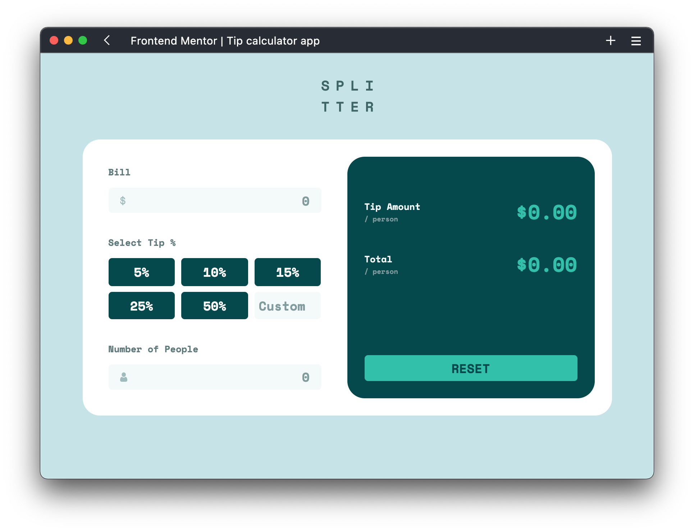

# Frontend Mentor - Tip calculator app solution

This is a solution to the [Tip calculator app challenge on Frontend Mentor](https://www.frontendmentor.io/challenges/tip-calculator-app-ugJNGbJUX). Frontend Mentor challenges help you improve your coding skills by building realistic projects.

## Table of contents

- [Overview](#overview)
  - [The challenge](#the-challenge)
  - [Screenshot](#screenshot)
  - [Links](#links)
  - [Useful resources](#useful-resources)
- [Author](#author)
- [Acknowledgments](#acknowledgments)

**Note: Delete this note and update the table of contents based on what sections you keep.**

## Overview

### The challenge

Users should be able to:

- View the optimal layout for the app depending on their device's screen size
- See hover states for all interactive elements on the page
- Calculate the correct tip and total cost of the bill per person

### Screenshot

### Links

- Solution URL: (https://www.frontendmentor.io/challenges/tip-calculator-app-ugJNGbJUX/hub/responsive-split-bill-app-iZ8y7eRZ3W)
- Live Site URL: (https://lucafisc.github.io/split-bill-app/)

### Useful resources

- [Put icon inside input element in a form (not as background image!)](https://localcoder.org/put-icon-inside-input-element-in-a-form-not-as-background-image) - This helped me to understand how to place the icons inside the input fields with a wrapping div with its position set to relative. Then it was just a matter of setting the image position to absolute and moving it to the exact location with the top and left attributes. 

## Author

- Frontend Mentor - [@lucafisc](https://www.frontendmentor.io/profile/lucafisc)

## Acknowledgments

Thanks to [@Eskabore](https://github.com/Eskabore) and [@Sammeeey](https://github.com/Sammeeey) for help on preventing mobile version to scroll horizontally.
